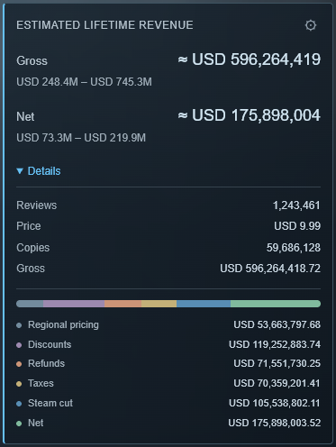

# Steam Revenue Estimate

A Chrome extension that shows estimated revenue for paid games directly on Steam, below the developer and publisher. All amounts are in USD.

  

## Features

- **Gross** and **Net** as full amounts, with a compact min–max range.
- Details with reviews, price, estimated copies sold, and a visual breakdown of regional pricing, discounts, refunds, taxes, and Steam's cut.
- Fine-tune the assumptions using the gear icon, save them for all games, or reset to defaults.
- English and Russian interfaces. No account or API key required.

## Installation

1. Download the extension ZIP from the [latest release](https://github.com/AspilateX/Steam-Revenue-Calculator-Chrome-Extention/releases/latest) and extract it to a permanent folder.
2. Open `chrome://extensions` and enable **Developer mode**.
3. Click **Load unpacked** and select the folder containing `manifest.json`.
4. Open or refresh a paid game's Steam page.

**Enable or disable:** use the toggle on the extension's card in `chrome://extensions`, then refresh the Steam page.

**Update:** download the new ZIP, replace the files in the same folder, click the reload button on the extension's card in `chrome://extensions`, and refresh the Steam page. Your saved settings will stay.

## How it works

The [Boxleiter method](https://greyaliengames.com/blog/how-to-estimate-how-many-sales-a-steam-game-has-made/) estimates copies sold as reviews × a multiplier. By default, the multiplier depends on the review count, and the adjustments match [Steam Revenue Calculator](https://steam-revenue-calculator.com/).

**Gross** = estimated copies × the regular US price. Regional pricing (9%), discounts (20%), and refunds (12%) are deducted from Gross; taxes (20%) and Steam's cut (30%) are deducted from the remaining balance. With default settings, **Net** is 29.5% of Gross. All assumptions can be adjusted.

These are approximate estimates, and Net is not profit. Free-to-play games, DLC, demos, and unreleased games are excluded. [More about the method](docs/methodology.md).

[MIT license](LICENSE). [Privacy and data use](docs/privacy.md).
